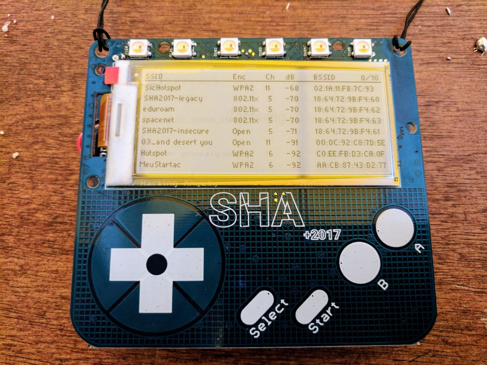

# Notes from hacking on the SHA2017 Badge

* [SHA2017 Wiki Page](https://wiki.sha2017.org/w/Projects:Badge)
* [SHA2017 Badge Hathery](https://badge.sha2017.org/)
* [MicroPython API Documentation](https://docs.micropython.org/en/latest/esp8266/index.html)

When connecting the badge to y our computer over use, it will appear as a usb serial device. You can connect to it with the following settings:

* Baudrate: 115200
* Data Bits: 8
* Stop Bits: 1

However I have found that it is best to use `mpfshell` as described below.

## Dev enviroment

Install `mpfshell` as described [here](https://github.com/wendlers/mpfshell).

`mpfshell` allows you to copy files to and from the badge as well as provide you an interactive shell.

### Using `mpfshell`

After launching `mpfshell` from the command line you must first connect it to the badge with with the open commend, ex: `open ttyUSB0`

Then you can brows the file-system and move files with `ls`, `cd`, `put`, `pull`, `cat`, `rm`, and `md`. You can find more information on these commands and more in the `mpfshell` help.

To run interactive python run `repl` from the `mpfshell` prompt after connecting the the device. Here you will be presented with an interactive python shell on the badge as if you had run python locally. You can exit the python shell and return to  `mpfshell` by pressing Ctrl+].

You can paste code into the shell and run it from memory on the badge. To do this press Ctrl+E from the interactive shell (`repl`) and then paste your code. After the paste is complete press Ctrl+D to signal EOF. At this point the code will be run immediately.

### Installing apps with `mpfshell`

To install applications while developing you need to create an app folder inside lib like so `/lib/APP_NAME` replacing "APP_NAME" with your app's name. And place at least one python file names `__init__.py` inside to contain your application code. Additional resources and code files can also be added.

A typical app installation process will like like this:

```
open ttyUSB0 
cd lib
rm APP_NAME
md APP_NAME
cd APP_NAME
put __init__.py
close
```

This can be scripted an run from the command line with `mpfshell -s install.mpf`. Example scripts can be found inside my app folders.

After the app is installed you can launch it from the badge menu. If you want to run it interactively so that you can view debugging output or exceptions launch the `repl` shell and run the following:

```
import appglue
appglue.start_app("APP_NAME")
```

### Troubleshooting

At the time of writing the badge firmware on the OTA server contains a bug where is never closes file handles and may not let you copy new files to the device. The pull request to fix this issue is [here](https://github.com/SHA2017-badge/micropython-esp32/pull/193/files). The badge build "Maffe Maniak" or newer had this fixed for me, but I had to have it flashed at the Badge Bar as it was not on the OTA server yet. A workaround for this is to paste your code into the interactive shell as described above.

Every now and then the badge seems to freese and will require you to press the reset button on the back to reconnect to it. Additionally, removing the battery and powering the badge with only USB when doing development also helps.

To prevent the badge from going to sleep while you are connected to it, ensure that it is in the main menu and every minute or so press the up or down button to keep it alive. Alternativly you can put it into "shell" mode by running `import shell` from the repl console.

## Apps

### [War Drive](war-drive/)

Simple War Driving app to let you see available Wireless networks.



### [ToorCamp](toorcamp/)

[Shameless plug!](https://toorcamp.toorcon.net)